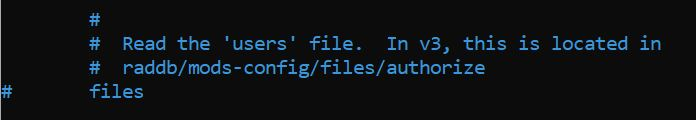
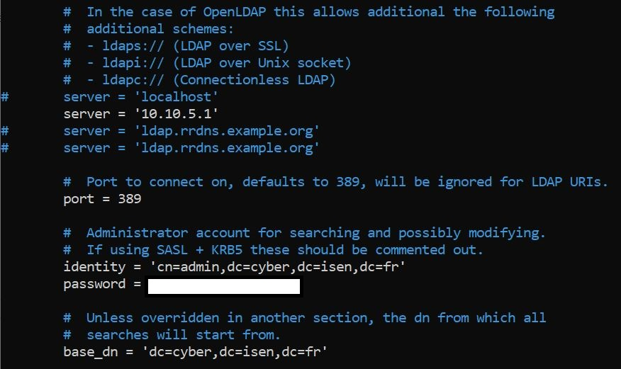

# Configuration de Freeradius avec LDAP
## I. Freeradius
### a. Installation de Freeradius
### b. Configuration de ldap dans Freeradius


## I. Freeradius

### a. Installation de Freeradius 
``` 
apt-get install freeradius freeradius-utils
```

### b. Configuration de ldap dans Freeradius

Il vous faut d'abord quelques prérequis. 

L'adresse IP du LDAP : 10.10.5.1   
Le port par défaut : 389   
Domaine Name : cn=admin,dc=cyber,dc=isen,dc=fr   
Il faut aussi le mot de passe du LDAP. Celui-ci devrait vous être fournit par un administrateur.


Après avoir installé Freeradius, nous pouvons commencer. Vous pouvez très bien utiliser nano pour ouvrir les fichiers. Il faut maintenant vérifier que tous les 'files' sont bien **commentés** dans le fichier default et inner-tunnel.

```
cd /etc/freeradius/3.0/sites-enabled/
vim default 
vim inner-tunnel
```



Dans ces mêmes fichiers, il faut vérifier que le module ldap soit bien **décommenté**.


Configurons le fichier dictionary.

```
cd ..
vim dictionary
```

A la fin du fichier, ajoutez la ligne suivante :

```
VALUE Auth-Type LDAP 5
```


Le module ldap peut ne pas être installé. Pour cela, installez-le :

```
apt install freeradius-ldap
```


Passons maintenant à la configuration du fihcier ldap :

```
cd mods-available/
vim ldap
```




Allons maintenant dans le fichier clients.conf

```
cd ..
vim clients.conf
```

Ajoutez un client avec les lignes suivantes :

```
client private-network-3 {
        ipaddr = 10.10.5.0/24
        secret = secret77
} 
```


Pour tester toutes ces configurations : 

```
systemctl restart freeradius
systemctl status freeradius
```

Pour passer freeradius en mode debug, ouvrez un nouveau terminal. Il faut que freeradius soit inactif avant de démarrer le debug. 

```
systemctl stop freeradius
freeradius -X
```

Vous devriez pouvoir voir en dernière ligne "Ready to process requests". Le freeradius en mode debug attend les demandes d'authentification. Si vous avez des erreurs et que vous voulez voir quel est le problème, il faut rediriger la sortie vers un fichier texte. Pour cela, on peut remplacer freeradius -X par ceci :

```
freeradius -X 2>&1 | tee debugfile
```

Dans le premier terminal, vous pouvez envoyer une ligne de commande pour tester l'authentification sur le serveur LDAP : 

```
radtest <user> <password> localhost 0 secret77
```

Vous devriez maintenant voir "Access-Accept" pour la dernière ligne de sortie.
